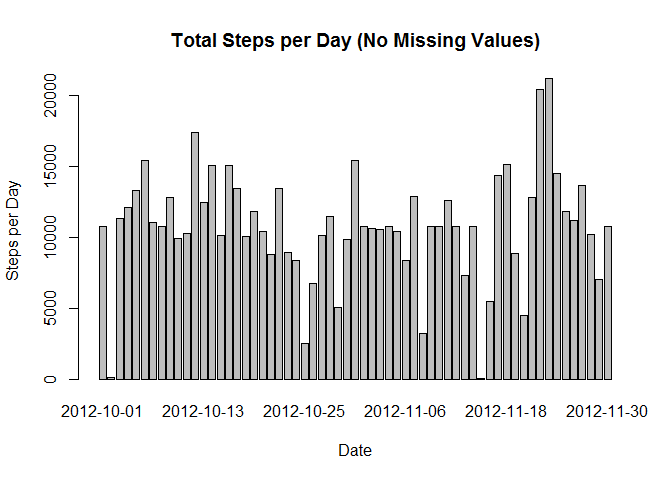

# Reproducible Research: Peer Assessment 1


## Loading and preprocessing the data


```r
activityMonitoringData  <- read.csv('activity.csv')
```

## What is mean total number of steps taken per day?  

### Calculate the total number of steps taken per day  


```r
stepsPerDay <- aggregate(x=activityMonitoringData$steps, by=list(activityMonitoringData$date), FUN=sum)
colnames(stepsPerDay) <- c('date', 'total')
```

Here are the first 6 rows of the stepsPerDay data.frame:  


```r
head(stepsPerDay)
```

```
##         date total
## 1 2012-10-01    NA
## 2 2012-10-02   126
## 3 2012-10-03 11352
## 4 2012-10-04 12116
## 5 2012-10-05 13294
## 6 2012-10-06 15420
```

### Make a histogram of the total number of steps taken each day  


```r
barplot(height=stepsPerDay$total, names.arg=stepsPerDay$date, main='Total Steps per Day', xlab='Date', ylab='Steps per Day')
```

 

### Calculate and report the mean and median of the total number of steps taken per day  


```r
meanStepsPerDay <- mean(stepsPerDay$total, na.rm=TRUE)
medianStepsPerDay <- median(stepsPerDay$total, na.rm=TRUE)
meanStepsPerDay
```

```
## [1] 10766.19
```

```r
medianStepsPerDay
```

```
## [1] 10765
```

## What is the average daily activity pattern?  

### Make a time series plot (i.e. type = "l") of the 5-minute interval (x-axis) and the average number of steps taken, averaged across all days (y-axis)  


```r
avgDailyActivity <- aggregate(steps~interval, data=activityMonitoringData, FUN=mean)
plot(avgDailyActivity, main='Average Daily Activity Pattern', xlab='5-Minute Interval', ylab='Average Number of Steps Taken', type='l')
```

 

### Which 5-minute interval, on average across all the days in the dataset, contains the maximum number of steps?  


```r
avgDailyActivity[which(avgDailyActivity$steps==max(avgDailyActivity$steps, na.rm=TRUE)),]
```

```
##     interval    steps
## 104      835 206.1698
```

## Imputing missing values  

### Calculate and report the total number of missing values in the dataset (i.e. the total number of rows with NAs)  


```r
sum(is.na(activityMonitoringData$steps))
```

```
## [1] 2304
```

### Devise a strategy for filling in all of the missing values in the dataset.  

The mean for that 5-minute interval will be used.  

### Create a new dataset that is equal to the original dataset but with the missing data filled in.  


```r
for (i in 1:nrow(activityMonitoringData)) {
    if (is.na(activityMonitoringData$steps[i])) {
        activityMonitoringData$steps[i] <- avgDailyActivity[which(activityMonitoringData$interval[i]==avgDailyActivity$interval),]$steps
    }
}
head(activityMonitoringData)
```

```
##       steps       date interval
## 1 1.7169811 2012-10-01        0
## 2 0.3396226 2012-10-01        5
## 3 0.1320755 2012-10-01       10
## 4 0.1509434 2012-10-01       15
## 5 0.0754717 2012-10-01       20
## 6 2.0943396 2012-10-01       25
```

### Make a histogram of the total number of steps taken each day and Calculate and report the mean and median total number of steps taken per day.  


```r
stepsPerDay2 <- aggregate(x=activityMonitoringData$steps, by=list(activityMonitoringData$date), FUN=sum)
colnames(stepsPerDay2) <- c('date', 'total')
barplot(height=stepsPerDay2$total, names.arg=stepsPerDay2$date, main='Total Steps per Day (No Missing Values)', xlab='Date', ylab='Steps per Day')
```

 

```r
 mean(stepsPerDay2$total, na.rm=TRUE)
```

```
## [1] 10766.19
```

```r
 median(stepsPerDay2$total, na.rm=TRUE)
```

```
## [1] 10766.19
```

### Do these values differ from the estimates from the first part of the assignment? What is the impact of imputing missing data on the estimates of the total daily number of steps?  

The differences between the two data sets is very small. The impact of replacing the missing data with the means for the 5-minute intervals is negligible.

## Are there differences in activity patterns between weekdays and weekends?  

### Create a new factor variable in the dataset with two levels - "weekday" and "weekend" indicating whether a given date is a weekday or weekend day.  


```r
for (i in 1:nrow(activityMonitoringData)) {
     if (weekdays(as.Date(activityMonitoringData$date[i])) %in% c('Saturday', 'Sunday')) {
         activityMonitoringData$daytype[i] <- 'weekend'
     }
     else {
         activityMonitoringData$daytype[i] <- 'weekday'
     }
}
activityMonitoringData$daytype = as.factor(activityMonitoringData$daytype)
head(activityMonitoringData)
```

```
##       steps       date interval daytype
## 1 1.7169811 2012-10-01        0 weekday
## 2 0.3396226 2012-10-01        5 weekday
## 3 0.1320755 2012-10-01       10 weekday
## 4 0.1509434 2012-10-01       15 weekday
## 5 0.0754717 2012-10-01       20 weekday
## 6 2.0943396 2012-10-01       25 weekday
```

### Make a panel plot containing a time series plot (i.e. type = "l") of the 5-minute interval (x-axis) and the average number of steps taken, averaged across all weekday days or weekend days (y-axis).  


```r
avgNumberSteps <- aggregate(steps~daytype+interval, data=activityMonitoringData, FUN=mean)
library('lattice')
xyplot(avgNumberSteps$steps~avgNumberSteps$interval | avgNumberSteps$daytype, xlab='Interval', ylab='Number of Steps', scales='free', layout=c(1, 2), type='l')
```

 
